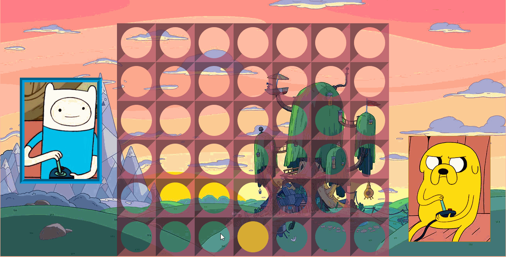

# C4 Adventure Time

is an Adventure Time themed Connect Four game, done during a course at [SPICED Academy](https://www.spiced.academy/program/full-stack-web-development/).

---

## Preview

## Try it out!

https://google.com

## Tech

HTML, CSS, JavaScript / jQuery

## Features

-   A board with six rows and seven columns
-   Two players take turns selecting a column to drop their checker into
-   Horizontal, vertical and diagonal conditions for victory are checked after each drop
-   When a player wins, a message appears to announce the victory, with different animations for each player
-   After a player wins it's possible to reset the game and play again

## Future

-   Add music, victory counter